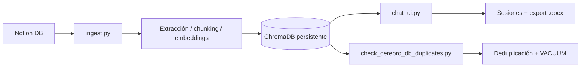
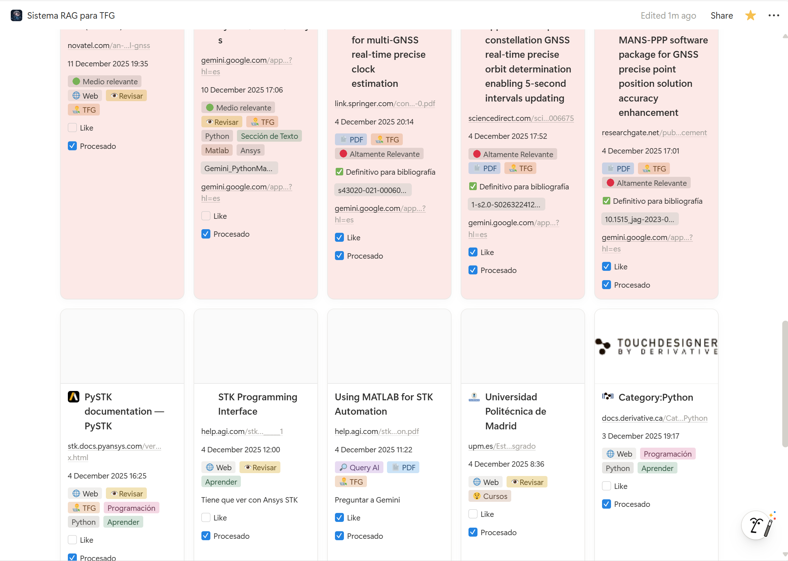
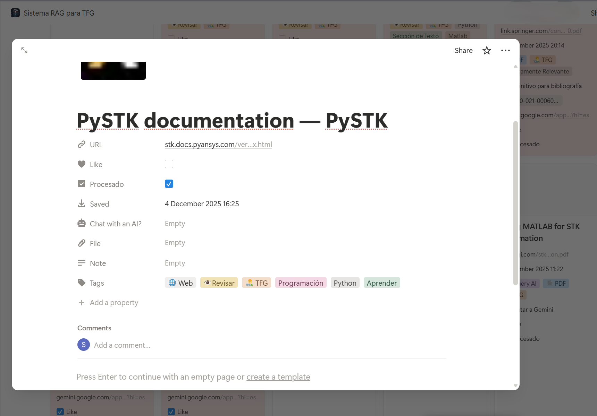
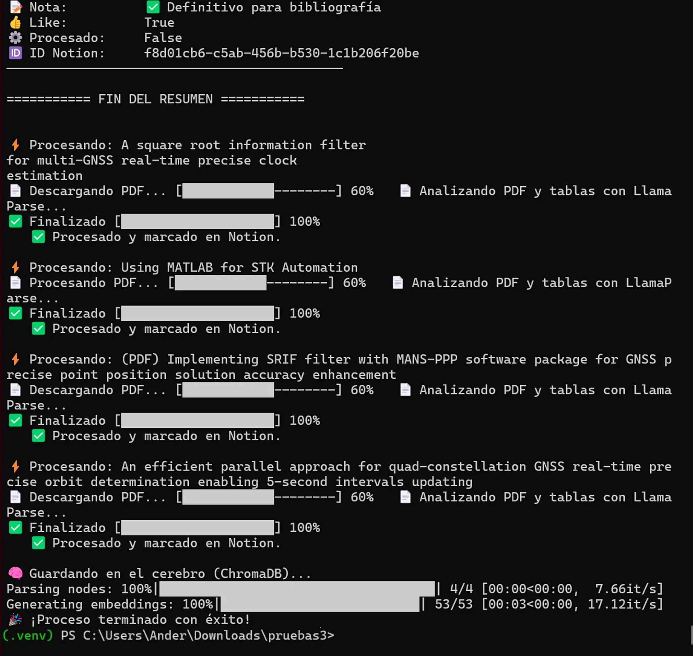
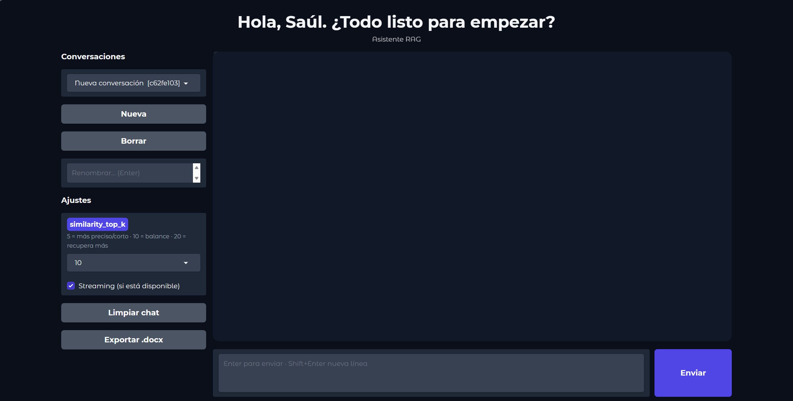
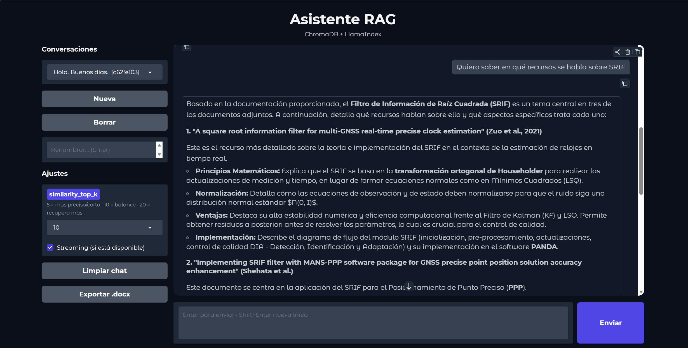
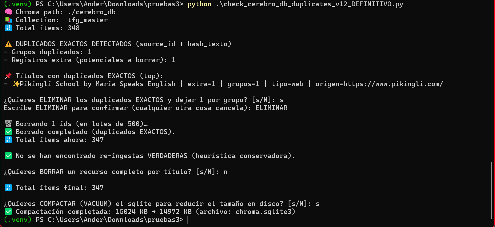

<div align="center">

# TFG RAG System — Notion → Ingesta → ChromaDB → Chat + Deduplicación

> **Convierte apuntes, PDFs, webs, vídeos y fotos en un buscador inteligente.**  
> Los recursos se gestionan desde Notion, el sistema los ingiere y los guarda en ChromaDB, y después se consulta todo desde un chat.

[](#instalacion)
[](#arquitectura)
[](#estructura-de-datos)

</div>

<a id="tabla-de-contenidos"></a>

## 📌 Tabla de Contenidos
- [Características](#caracteristicas)
- [Arquitectura del Pipeline](#arquitectura)
- [Requisitos](#requisitos)
- [Instalación](#instalacion)
- [Configuración](#configuracion)
- [Uso](#uso)
- [Estructura de Datos](#estructura-de-datos)
- [Visualizaciones](#visualizaciones)
- [Estructura del Proyecto](#estructura-del-proyecto)
- [Ejemplos de Uso](#ejemplos-de-uso)
- [Licencia](#licencia)
- [Contacto](#contacto)

<a id="caracteristicas"></a>

## ✅ Características
- Ingesta **controlada desde Notion** (marcado automático de `Procesado`).
- Fuentes: **PDF** (LlamaParse) · **Web** · **YouTube** (yt-dlp + Whisper) · **Imágenes** (Gemini Vision).
- Persistencia local en **ChromaDB** (`./cerebro_db` por defecto).
- **Chat UI** con sesiones en `ui_sessions/` y **exportación a `.docx`**.
- Script de **auditoría y limpieza**: duplicados exactos, re-ingestas y compactación opcional del SQLite.

<a id="arquitectura"></a>

## 🧩 Arquitectura del Pipeline

**Flujo (alto nivel):**
1. **Base de datos de Notion** → selección y estado (`Procesado`)
2. `ingest.py` → extracción + chunking + embeddings
3. **ChromaDB** → persistencia (`CHROMA_PATH`)
4. `chat_ui.py` → consulta + sesiones + exportación
5. `check_cerebro_db_duplicates.py` → mantenimiento (dedup / borrado / VACUUM)

**Diagrama:**


<a id="requisitos"></a>

## 🧰 Requisitos
- **Python 3.11+**
- **FFmpeg** (necesario para `openai-whisper` y `yt-dlp`)

Windows (winget):
```powershell
winget install Gyan.FFmpeg
```

**SQLite CLI (opcional):** útil para inspección manual de `chroma.sqlite3`.  
Los scripts usan el módulo `sqlite3` de Python, así que **no es requisito**.

```powershell
winget install SQLite.SQLite
```

<a id="instalacion"></a>

## 💻 Instalación
```powershell
python -m venv .venv
.\.venv\Scripts\Activate.ps1
python -m pip install -U pip setuptools wheel
python -m pip install -U uv
uv pip install -r .\requirements.txt
```

<a id="configuracion"></a>

## ⚙️ Configuración (.env)

Copiar `.env.example` a `.env` y completar:

- **Notion (ingesta)**
  - `NOTION_TOKEN`: crear una **Integration** en Notion y copiar el **Internal Integration Token**. Compartir la **database** con esa integración con permisos de **lectura/escritura** (se lee la database y se actualiza la propiedad `Procesado` al finalizar cada ingesta).
  - `NOTION_DATABASE_ID`: ID de la base de datos (se obtiene desde la URL/enlace de la propia DB).

- **Modelos / APIs**
  - `GOOGLE_API_KEY`: crear una API key para Gemini (Google AI Studio / Google Cloud) y habilitar el acceso al modelo.
  - `GEMINI_TEXT_MODEL`: modelo de texto (por defecto: `gemini-3-flash-preview`).
  - `GEMINI_VISION_MODEL`: modelo de visión (por defecto: `gemini-3-pro-image-preview`).
  - `LLAMA_CLOUD_API_KEY`: API key de LlamaCloud/LlamaParse (desde su panel) para parseo de PDFs.

- **Chroma**
  - `CHROMA_PATH`: ruta al vector DB persistente (por defecto: `./cerebro_db`).
  - `COLLECTION_NAME`: nombre de colección (por defecto: `tfg_master`).

> Seguridad: no subir `.env` a GitHub. Solo versionar `.env.example`.

<a id="uso"></a>

## ▶️ Uso
```powershell
# 1) Ingesta desde Notion → ChromaDB
python ingest.py

# 2) Chat contra el “cerebro”
python chat_ui.py

# 3) Auditoría / borrado / deduplicación
python check_cerebro_db_duplicates.py
```

<a id="estructura-de-datos"></a>

## 🗂️ Estructura de Datos

### Plantilla de Notion (lista para duplicar)

Se ofrece una plantilla pública de la base de datos de Notion (sin información sensible) para replicar rápidamente la estructura y propiedades requeridas.

- 📌 Duplicar plantilla: https://ripe-conga-3d3.notion.site/2e110e76eff881adbbbcc6f959243447?v=2e110e76eff88105a432000c9b9f4bbb&source=copy_link

> Guía práctica (plantilla de propiedades + “Save to Notion”): `docs/notion_template.md`.

### ChromaDB (metadatos guardados)
Cada documento se almacena con metadatos consistentes (ejemplo):
- `titulo`
- `origen`
- `tipo`
- `notion_id` (page_id)

<a id="visualizaciones"></a>

## 📸 Visualizaciones
  
  
  
  
  


<a id="estructura-del-proyecto"></a>

## 🧱 Estructura del Proyecto
```text
sistema-rag-tfg/
├── ingest.py
├── chat_ui.py
├── check_cerebro_db_duplicates.py
├── requirements.txt
├── .env.example               # copiar a .env
├── README.md
├── LICENSE
├── .gitignore
├── .gitattributes
├── docs/
│   └── notion_template.md
├── .github
│   └── ISSUE_TEMPLATE
│      ├── bug_report.md
│      └── feature_request.md
├── assets/
    ├── chat_ui_run_1.png
    ├── chat_ui_run_2.png
    ├── check_run.png
    ├── ingest_run.png
    ├── notion_db.png
    └── notion_dbs_page.png
├── ui_sessions/               # se crea/usa en runtime (no subir a GitHub)
├── cerebro_db/                # se crea/usa en runtime (no subir a GitHub)
└── .venv/                     # entorno local (no subir a GitHub)
```

<a id="ejemplos-de-uso"></a>

## 🧪 Ejemplos de Uso
- **Re-ingerir un recurso**: en Notion, desmarcar `Procesado` y ejecutar `python ingest.py`.
- **Eliminar duplicados**: ejecutar `python check_cerebro_db_duplicates.py` y seguir el modo interactivo.
- **Reducir tamaño del SQLite**: usar la compactación del script (puede fallar si el fichero está en uso).

<a id="licencia"></a>

## 📄 Licencia
Este proyecto se distribuye bajo la licencia incluida en el repositorio (`LICENSE`).

<a id="contacto"></a>

## 👤 Contacto
[](https://github.com/ASaulGG)
[](https://www.linkedin.com/in/asaulgg/)
[](mailto:saulcv7890@gmail.com)