<div align="center">

# TFG RAG System — Notion → Ingesta → ChromaDB → Chat + Deduplicación

> **Convierte tus apuntes, PDFs, webs, vídeos y fotos en un buscador inteligente.**  
> Gestionas los recursos desde Notion, el sistema los ingiere y los guarda en ChromaDB, y luego consultas todo desde un chat.

[](#instalacion)
[](#arquitectura)
[](#estructura-de-datos)

</div>

<a id="tabla-de-contenidos"></a>

## 📌 Tabla de Contenidos
- [Características](#caracteristicas)
- [Arquitectura del Pipeline](#arquitectura)
- [Requisitos](#requisitos)
- [Instalación](#instalacion)
- [Configuración](#configuracion)
- [Uso](#uso)
- [Estructura de Datos](#estructura-de-datos)
- [Visualizaciones](#visualizaciones)
- [Estructura del Proyecto](#estructura-del-proyecto)
- [Ejemplos de Uso](#ejemplos-de-uso)
- [Licencia](#licencia)
- [Contacto](#contacto)

<a id="caracteristicas"></a>

## ✅ Características
- Ingesta **controlada desde Notion** (marcado automático de `Procesado`).
- Fuentes: **PDF** (LlamaParse) · **Web** · **YouTube** (yt-dlp + Whisper) · **Imágenes** (Gemini Vision).
- Persistencia local en **ChromaDB** (`./cerebro_db` por defecto).
- **Chat UI** con sesiones en `ui_sessions/` y **exportación a `.docx`**.
- Script de **auditoría y limpieza**: duplicados exactos, re-ingestas y compactación opcional del SQLite.

<a id="arquitectura"></a>

## 🧩 Arquitectura del Pipeline

**Flujo (alto nivel):**
1. **Base de datos de Notion** → selección y estado (`Procesado`)
2. `ingest.py` → extracción + chunking + embeddings
3. **ChromaDB** → persistencia (`CHROMA_PATH`)
4. `chat_ui.py` → consulta + sesiones + exportación
5. `check_cerebro_db_duplicates.py` → mantenimiento (dedup / borrado / VACUUM)

**Diagrama:**

```mermaid
flowchart LR
  A[Notion DB] --> B[ingest.py]
  B --> C[Extracción / chunking / embeddings]
  C --> D[(ChromaDB persistente)]
  D --> E[chat_ui.py]
  D --> F[check_cerebro_db_duplicates.py]
  E --> G[Sesiones + export .docx]
  F --> H[Deduplicación + VACUUM]
```


<a id="requisitos"></a>

## 🧰 Requisitos
- **Python 3.11+**
- **FFmpeg** (necesario para `openai-whisper` y `yt-dlp`)

Windows (winget):
```powershell
winget install Gyan.FFmpeg
```

**SQLite CLI (opcional):** útil para inspección manual de `chroma.sqlite3`.  
Los scripts usan el módulo `sqlite3` de Python, así que **no es requisito**.

```powershell
winget install SQLite.SQLite
```

<a id="instalacion"></a>

## 💻 Instalación
```powershell
python -m venv .venv
.\.venv\Scripts\Activate.ps1
python -m pip install -U pip setuptools wheel
python -m pip install -U uv
uv pip install -r .\requirements.txt
```

<a id="configuracion"></a>

## ⚙️ Configuración (.env)

Copia `.env.example` a `.env` y completa:

- **Notion (ingesta)**
  - `NOTION_TOKEN`: crea una **Integration** en Notion y copia el **Internal Integration Token**. Comparte tu **database** con esa integración con permisos de **lectura/escritura** (se lee la database y se actualiza la propiedad `Procesado` al finalizar cada ingesta).
  - `NOTION_DATABASE_ID`: ID de la base de datos (se obtiene desde la URL/enlace de la propia DB).

- **Modelos / APIs**
  - `GOOGLE_API_KEY`: crea una API key para Gemini (Google AI Studio / Google Cloud) y habilita el acceso al modelo.
  - `GEMINI_TEXT_MODEL`: modelo de texto (por defecto: `gemini-3-flash-preview`).
  - `GEMINI_VISION_MODEL`: modelo de visión (por defecto: `gemini-3-pro-image-preview`).
  - `LLAMA_CLOUD_API_KEY`: API key de LlamaCloud/LlamaParse (desde su panel) para parseo de PDFs.

- **Chroma**
  - `CHROMA_PATH`: ruta al vector DB persistente (por defecto: `./cerebro_db`).
  - `COLLECTION_NAME`: nombre de colección (por defecto: `tfg_master`).

> Seguridad: no subas tu `.env` a GitHub (no hagas `git add/commit`). Solo versiona `.env.example`.

<a id="uso"></a>

## ▶️ Uso
```powershell
# 1) Ingesta desde Notion → ChromaDB
python ingest.py

# 2) Chat contra el “cerebro”
python chat_ui.py

# 3) Auditoría / borrado / deduplicación
python check_cerebro_db_duplicates.py
```

<a id="estructura-de-datos"></a>

## 🗂️ Estructura de Datos

### Notion (mínimo recomendado)
- **Title**: propiedad tipo *title* (cualquier nombre; se detecta automáticamente).
- `Procesado` (*checkbox*): marca si el recurso ya se ingirió.
- `URL` (*url*): para recursos web.
- `File` (*files*): para PDFs u otros adjuntos.
- `Tags` (*multi_select*), `Note` (*rich_text*), `Like` (*checkbox*): opcionales.

### ChromaDB (metadatos guardados)
Cada documento se almacena con metadatos consistentes (ejemplo):
- `titulo`
- `origen`
- `tipo`
- `notion_id` (page_id)

<a id="visualizaciones"></a>

## 📸 Visualizaciones
  
  
  
  
  


<a id="estructura-del-proyecto"></a>

## 🧱 Estructura del Proyecto
```text
sistema-rag-tfg/
├─ ingest.py
├─ chat_ui.py
├─ check_cerebro_db_duplicates.py
├─ requirements.txt
├─ .env.example               # copiar a .env
├─ README.md
├─ LICENSE
├─ .gitignore
├─ assets/
├─ ui_sessions/               # se crea/usa en runtime (no subir a GitHub)
├─ cerebro_db/                # se crea/usa en runtime (no subir a GitHub)
└─ .venv/                     # entorno local (no subir a GitHub)
```

<a id="ejemplos-de-uso"></a>

## 🧪 Ejemplos de Uso
- **Re-ingerir un recurso**: en Notion, desmarca `Procesado` y ejecuta `python ingest.py`.
- **Eliminar duplicados**: ejecuta `python check_cerebro_db_duplicates.py` y sigue el modo interactivo.
- **Reducir tamaño del SQLite**: usa la compactación del script (puede fallar si el fichero está en uso).

<a id="licencia"></a>

## 📄 Licencia
Este proyecto se distribuye bajo la licencia incluida en el repositorio (`LICENSE`).

<a id="contacto"></a>

## 👤 Contacto
[](https://github.com/ASaulGG)
[](https://www.linkedin.com/in/asaulgg/)
[](mailto:saulcv7890@gmail.com)

